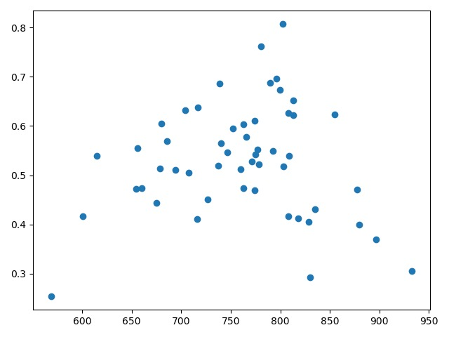
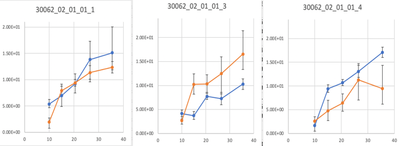
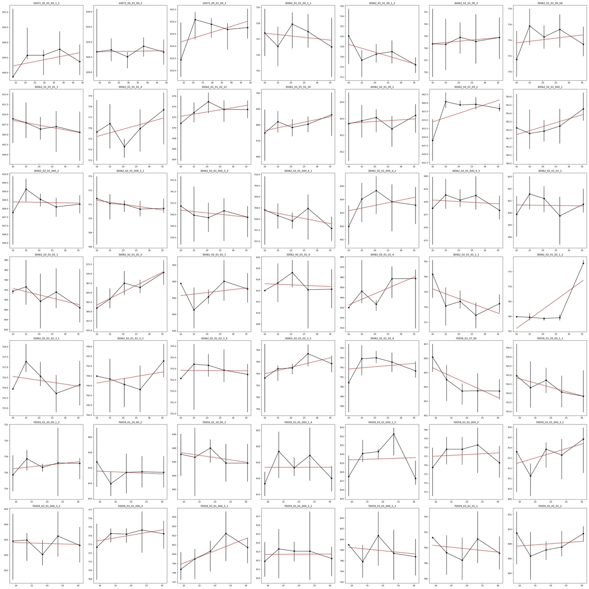
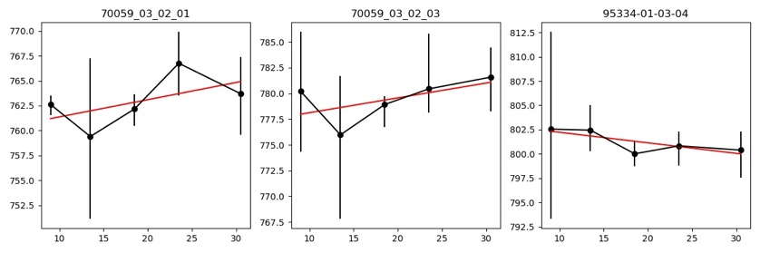

# Explosion Process of the Neutron Star X-ray binary 4U 1608-52

## 2019-2020, B.Sc 

- Funded by Student **Research Training Program (SRTP)**
- **The Second Prize** in 2020, Shandong University 

## ABSTRACT

**abstract:** Studying all the RXTE/PCA observations for 4U 1608-52 systematically, we have already discovered that it has a sharp KHz QPO with plenty two QPOs appearing simultaneously in the PDS. I have confirmed that as energy increases, the relation with RMS amplitude evolves keep positive while slope of the upper KHz QPO switch to slower one. The newly discovered patterns provide new limits on the QPO models.

**Key words:**LMXB, QPO, RMS

## DATA 

The data from LMXB 4U 1608-52 is observed by the Proportional Counter Array (PCA) on board the Rossi X-ray Timing Explorer (RXTE). 

## METHOD

I calculate light curve through HEASOFT, but then furthermore plot dynamic power density spectrum (PDS) using HEASFOT either. 

In order to choose the suitable time resolution, I develop a Python wrapper to automatically calculate dynamic PDS, and plot Grayscale images of frequency, time, and photon flux based on dynamic PDS. 

In order to better fitting QPO, I adopt Leahy normalization to processing PDS but not transition from light curve. In sequence, we use POWSPEC to fitted QPOs, and then calculate quality factor *Q* and *rms amplitude* in sequence.

## RESULT

### Correlation Between Harmonic QPO Frequencies and Their Frequency Differences

Here is a relationship between the frequencies of 22 observation numbers that contain two QPOs. As seen in the left panel, there is essentially a positive linear relationship between them. The frequency difference between the higher and lower frequencies narrows as the lower frequency increases, as shown in the right panel.

###  Correlation Between QPO Frequency and RMS Amplitude 

As illustrated below, the red dots represent the lower QPO, the blue dots represent the upper panel, and the green dots represent observation numbers with only one QPO.  The lower frequency ranges from 500Hz to approximately 900Hz. As the frequency increases, the RMS amplitude initially rises and then falls, peaking at around 750Hz with a maximum RMS value of about 10. Overall, its shape resembles a hump. In contrast, the upper frequency begins at 450Hz. The RMS value initially remains steady and then starts to decline from 14, showing a noticeable drop around 850Hz, and reaching its lowest value of 4 near 1050Hz. For the observation numbers with two QPOs, the distinction between upper and lower QPO is clear. However, for observation numbers with a single QPO, it's challenging to determine whether it's an upper or lower QPO.

To address this issue, we plot the correlation between the quality factor *Q* and frequency. As can be seen from the image, the *Q* of the upper-frequency QPOs is mostly concentrated in the interval of *Q* <20 (right panel), and it generally exhibits a positive correlation. The behavior of the lower-frequency QPO is more complex, but overall, the *Q* factor transitions from a positive to a negative correlation with frequency, peaking at ~180 around a frequency of ~800Hz. This inflection point is offset by about 50Hz from the point where RMS changes with frequency.

###  Correlation Between QPO Frequency and RMS Amplitude 

Because the photon number approaches zero in high-energy channels, we divide the channel into five periods and fit the QPOs separately. 

We use a linear square method to fit the correlation and plot the relationship between the k-value and QPO frequency below.

The plot above shows the correlation between the lower QPO RMS amplitude and energy. This illustrates that the relationship with RMS amplitude remains positive, even as the slope of the lower KHz QPO transitions to a gentler one. Only a few show fluctuations, and fewer exhibit negative values.

 The y-axis represents the k-value, while the x-axis represents the frequency value. The plot indicates that the k-value increases and decreases as the frequency rises, yet all values remain positive. The inflection point is around 800Hz, consistent with the results presented earlier.

For the upper QPOs, most of them have a failed fitting due to resolution limitations. Here, we present three successful fitting examples. The plot suggests that the upper QPOs consistently increase as the frequency rises. However, we need data from higher energy channels to reinforce this conclusion due to the large error bar. 

​	

###  Correlation Between QPO Frequency and Photon Energy

Following the same logic, we plot the correlation between frequency and photon energy. The plots display both upper and lower QPOs sequentially. They illustrate that as the energy increases, the frequency remains almost unchanged, regardless of whether it's an upper or lower situation.

 

## Discussion and Conclusion

In this paper, we explore the correlation between the frequency of upper and lower QPOs, the correlation between the Q factor and frequency, and the correlation between RMS amplitude and frequency. Additionally, we investigate, for the first time, the correlation between RMS amplitude, frequency, and photon energy for 4U 1608-52. After analyzing all the data observed by RXTE/PCA, we identified a positive relationship between upper and lower QPOs; the distinction decreases as the frequency of the lower QPOs rises. Furthermore, we find that the Q factor first increases and then decreases, while the RMS amplitude remains almost unchanged as the frequency increases. This behavior is consistent with the properties observed in most lower QPOs. Drawing a conclusion for the upper QPOs is challenging due to the limited fitting results, but the overall trend appears positive.